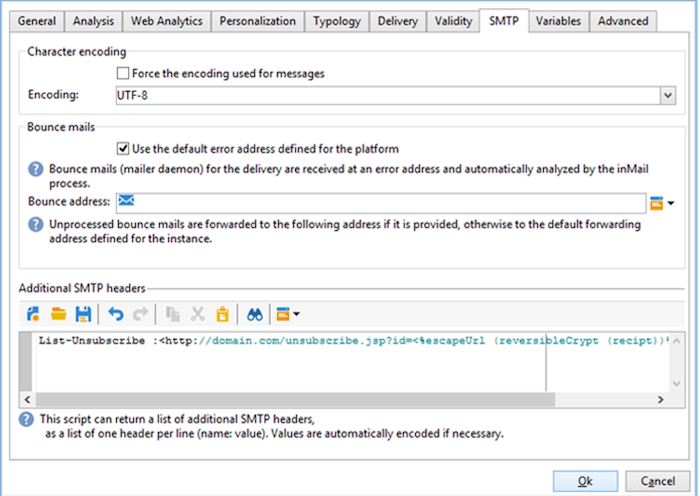
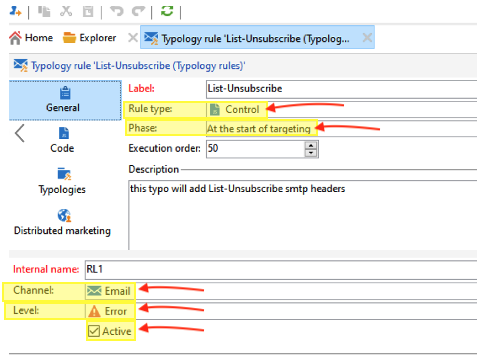

# Campaign Classic - Technical recommendations {#technical-recommendations}

Several techniques, configurations, and tools that you can use to improve your deliverability rate when using Adobe Campaign Classic are listed below.

## Configuration {#configuration}

### Reverse DNS {#reverse-dns}

Adobe Campaign checks whether a reverse DNS is given for an IP address and that this correctly points back to the IP.

An important point in the network configuration is making sure a correct reverse DNS is defined for each of the IP addresses for outgoing messages. This means that for a given IP address, there is a reverse DNS record (PTR record) with a matching DNS (A record) looping back to the initial IP address.

The domain choice for a reverse DNS has an impact when dealing with certain ISPs. AOL, in particular, only accepts feedback loops with an address in the same domain as the reverse DNS (see [Feedback loop](#feedback-loop)).

>[!NOTE]
>
>You can use [this external tool](https://mxtoolbox.com/SuperTool.aspx) to verify the configuration of a domain.

### MX rules {#mx-rules}

MX rules (Mail eXchanger) are the rules that manage communication between a sending server and a receiving server.

More precisely, they are used to control the speed at which the Adobe Campaign MTA (Message Transfer Agent) sends emails to each individual email domain or ISP (for example, hotmail.com, comcast.net). These rules are typically based on limits published by the ISPs (for example, do not include more than 20 messages per each SMTP connection).

>[!NOTE]
>
>For more on MX management in Adobe Campaign Classic, refer to [this section](https://experienceleague.adobe.com/docs/campaign-classic/using/installing-campaign-classic/additional-configurations/email-deliverability.html#mx-configuration).

### TLS {#tls}

TLS (Transport Layer Security) is an encryption protocol that can be used to secure the connection between two email servers and protect the content of an email from being read by anyone other than the intended recipients.

### Sender's domain {#sender-domain}

To define the domain used for the HELO command, edit the instance's configuration file (conf/config-instance.xml) and define a "localDomain" attribute as follows:

```
<serverConf>
  <shared>
    <dnsConfig localDomain="mydomain.net"/>
  </shared>
</serverConf>
```

The MAIL FROM domain is the domain used in technical bounce messages. This address is defined in the deployment wizard or via the NmsEmail_DefaultErrorAddr option.

### SPF record {#dns-configuration}

An SPF record can currently be defined on a DNS server as a TXT type record (code 16) or an SPF type record (code 99). An SPF record takes the form of a character string. For example:

```
v=spf1 ip4:12.34.56.78/32 ip4:12.34.56.79/32 ~all
```

defines the two IP addresses, 12.34.56.78 and 12.34.56.79, as authorized to send emails for the domain. **~all** means that any other address should be interpreted as a SoftFail.

Recommendations for defining an SPF record:

* Add **~all** (SoftFail) or **-all** (Fail) at the end to reject all servers other than those defined. Without this, servers will be able to forge this domain (with a Neutral evaluation).
* Do not add **ptr** (openspf.org recommends against this as costly and unreliable).

>[!NOTE]
>
>Learn more on SPF in [this section](/help/additional-resources/authentication.md#spf).

## Authentication

>[!NOTE]
>
>Learn more on the different forms of email authentication in [this section](/help/additional-resources/authentication.md).

### DKIM {#dkim-acc}

>[!NOTE]
>
>For hosted or hybrid installations, if you have upgraded to the [Enhanced MTA](https://experienceleague.adobe.com/docs/campaign-classic/using/sending-messages/sending-emails/sending-an-email/sending-with-enhanced-mta.html#sending-messages), DKIM email authentication signing is done by the Enhanced MTA for all messages with all domains.

Using [DKIM](/help/additional-resources/authentication.md#dkim) with Adobe Campaign Classic requires the following prerequisite:

**Adobe Campaign option declaration**: in Adobe Campaign, the DKIM private key is based on a DKIM selector and a domain. It is not currently possible to create multiple private keys for the same domain/sub-domain with different selectors. It is not possible to define which selector domain/sub-domain must be used for the authentication in neither the platform or the email. The platform will alternatively select one of the private keys, which means the authentication has a high chance of failing.

* If you have configured DomainKeys for your Adobe Campaign instance, you just need to select **dkim** in the [Domain management rules](https://experienceleague.adobe.com/docs/campaign-classic/using/sending-messages/monitoring-deliveries/understanding-delivery-failures.html#email-management-rules). If not, follow the same configuration steps (private/public key) as for DomainKeys (which replaced DKIM).
* It is not necessary to enable both DomainKeys and DKIM for the same domain as DKIM is an improved version of DomainKeys.
* The following domains currently validate DKIM: AOL, Gmail.

## Feedback loop {#feedback-loop-acc}

A feedback loop works by declaring at the ISP level a given email address for a range of IP addresses used for sending messages. The ISP will send to this mailbox, in a similar way as what is done for bounce messages, those messages that are reported by recipients as spam. The platform should be configured to block future deliveries to users who have complained. It is important to no longer contact them even if they did not use the proper opt-out link. It is based on these complaints that an ISP will add an IP address to its denylist. Depending on the ISP, a complaint rate of around 1% will result in blocking an IP address.

A standard is currently being drawn up to define the format of feedback loop messages: the [Abuse Feedback Reporting Format (ARF)](https://tools.ietf.org/html/rfc6650).

Implementing a feedback loop for an instance requires:

* A mailbox dedicated to the instance, which may be the bounce mailbox
* IP sending addresses dedicated to the instance

Implementing a simple feedback loop in Adobe Campaign uses the bounce message functionality. The feedback loop mailbox is used as a bounce mailbox and a rule is defined to detect these messages. The email addresses of the recipients who reported the message as spam will be added to the quarantine list.

* Create or modify a bounce mail rule, **Feedback_loop**, in **[!UICONTROL Administration > Campaign Management > Non deliverables Management > Mail rule sets]** with the reason **Refused** and the type **Hard**.
* If a mailbox has been defined specially for the feedback loop, define the parameters to access it by creating a new external Bounce Mails account in **[!UICONTROL Administration > Platform > External accounts]**.

The mechanism is immediately operational to process complaint notifications. To make sure this rule is working correctly, you can temporarily deactivate the accounts so that they do not collect these messages, then check the contents of the feedback loop mailbox manually. On the server, execute the following commands:

```
nlserver stop inMail@instance,
nlserver inMail -instance:instance -verbose.
```

If you are forced to use one single feedback loop address for multiple instances, you must:

* Replicate the messages received on as many mailboxes as there are instances,
* Have each mailbox picked up by one single instance,
* Configure the instances so that they only process the messages that concern them: the instance information is included in the Message-ID header of messages sent by Adobe Campaign and is therefore located also in the feedback loop messages. Simply specify the **checkInstanceName** parameter in the instance configuration file (by default, the instance is not verified and this may lead certain address to be quarantined incorrectly):

  ```
  <serverConf>
    <inMail checkInstanceName="true"/>
  </serverConf>
  ```

Adobe Campaign's Deliverability service manages your subscription to feedback loop services for the following ISPs: AOL, BlueTie, Comcast, Cox, EarthLink, FastMail, Gmail, Hotmail, HostedEmail, Libero, Mail.ru, MailTrust, OpenSRS, QQ, RoadRunner, Synacor, Telenor, Terra, UnitedOnline, USA, XS4ALL, Yahoo, Yandex, Zoho.

## List-Unsubscribe {#list-unsubscribe}

Adding an SMTP header called **List-Unsubscribe** is mandatory to ensure optimal deliverability management.

This header can be used as an alternative to the "Report as SPAM" icon. It displays as an "Unsubscribe" link in the ISPs' email interfaces.

Using this functionality lowers complaint rates and helps to protect your reputation. Feedback will be executed as an unsubscribe.

Gmail, Outlook.com, Yahoo! and Microsoft Outlook support this method. An "Unsubscribe" link is available directly in their interface. For example:


>[!NOTE]
>
>The "Unsubscribe" link may not always be displayed. Indeed, it can depend on each ISP's specific criteria and policy. Therefore, make sure your messages are sent by a sender:
>
>* With good reputation
>* Under the ISPs' spam complaint threshold
>* Fully authenticated

Two versions of the List-Unsubscribe header functionality exist:

* **"mailto" List-Unsubscribe** - With this method, clicking the **Unsubscribe** link sends a pre-filled email to the unsubscribe address specified in the email header. [Learn more](#mailto-list-unsubscribe)

<!--OR: With this method, clicking the **Unsubscribe** link opens the user's default email client with a pre-filled email to the unsubscribe address specified in the email header. This allows the user to unsubscribe simply by sending the email without any further manual steps.-->

* **"One-Click" List-Unsubscribe** - With this method, clicking the **Unsubscribe** link directly unsubscribes the user. [Learn more](#one-click-list-unsubscribe)

### "mailto" List-Unsubscribe {#mailto-list-unsubscribe}

With this method, clicking the **Unsubscribe** link sends a pre-filled email to the unsubscribe address specified in the email header.

To use "mailto" List-Unsubscribe, you must enter a command line where you specify an email address, such as: `List-Unsubscribe: <mailto:client@newsletter.example.com?subject=unsubscribe?body=unsubscribe>`

>[!CAUTION]
>
>The example above is based on the recipient table. If database implementation is done from another table, make sure to reword the command line with the correct information.

You can also create a dynamic "mailto" List-Unsubscribe using a command line such as: `List-Unsubscribe: <mailto:<%=errorAddress%>?subject=unsubscribe%=message.mimeMessageId%>`

To implement **"mailto" List-Unsubscribe** in Campaign, you can either:

* Directly add the command line in the delivery or delivery template - [Learn how](#adding-a-command-line-in-a-delivery-template)

* Create a typology rule - [Learn how](#creating-a-typology-rule)

#### Adding a command line in a delivery or template {#adding-a-command-line-in-a-delivery-template}

The command line must be added into the **[!UICONTROL Additional SMTP headers]** section of the email's SMTP header.

This addition can be done in each email, or in existing delivery templates. You can also create a new delivery template that includes this functionality.

For example, enter the following script into the **[!UICONTROL Additional SMTP headers]** field: `List-Unsubscribe: mailto:unsubscribe@domain.com`. Clicking the **unsubscribe** link sends an email to the unsubscribe@domain.com address.

You can also use a dynamic address. For example, to send an email to the error address defined for the platform, you can use the following script: `List-Unsubscribe: <mailto:<%=errorAddress%>?subject=unsubscribe%=message.mimeMessageId%>`


<!--
List-Unsubscribe: mailto:unsubscribe@domain.com 
* Clicking the **unsubscribe** link opens the user's default email client. This typology rule must be added in a typology used for creating email.

List-Unsubscribe: https://domain.com/unsubscribe.jsp 

* Clicking the **unsubscribe** link redirects the user to your unsubscribe form.

  
-->

#### Creating a typology rule {#creating-a-typology-rule}

The rule must contain the script that generates the command line and it must be included in the email header.

Learn how to create typology rules in Adobe Campaign v7/v8 in [this section](https://experienceleague.adobe.com/docs/campaign-classic/using/orchestrating-campaigns/campaign-optimization/about-campaign-typologies.html#typology-rules).

>[!NOTE]
>
>We recommend creating a typology rule: the List-Unsubscribe functionality will be automatically added in each email using this typolgy rule.

### One-Click List-Unsubscribe {#one-click-list-unsubscribe}

With this method, clicking the **Unsubscribe** link directly unsubscribes the user, requiring only a single action to unsubscribe.

To comply with this requirement, senders must: 
 
* Add the following command line: `List-Unsubscribe-Post: List-Unsubscribe=One-Click`.
* Include a URI unsubscribe link.
* Support reception of the HTTP POST response from the receiver, which Adobe Campaign supports. You can also use an external service.
 
To support the One-Click List-Unsubscribe POST response directly in Adobe Campaign v7/v8, you must add in the "Unsubscribe recipients no-click" web application. To do so: 

1. Go to **[!UICONTROL Resources]** > **[!UICONTROL Online]** > **[!UICONTROL Web applications]**.

1. Upload the "Unsubscribe recipients no-click" [XML](/help/assets/WebAppUnsubNoClick.xml.zip) file.

To configure **One-Click List-Unsubscribe** in Campaign, you can either:

* Add the command line in the delivery or delivery template - [Learn how](#one-click-delivery-template)
* Create a typology rule - [Learn how](#one-click-typology-rule)

#### Configuring One-Click List-Unsubscribe in the delivery or template {#one-click-delivery-template}

To configure One-Click List-Unsubscribe in the delivery or delivery template, follow the steps below.

1. Go to the **[!UICONTROL SMTP]** section of the delivery properties.

1. Under **[!UICONTROL Additional SMTP Headers]**, enter the command lines such as in the example below. Each header should be on a separate line.

For example:

```
List-Unsubscribe-Post: List-Unsubscribe=One-Click
List-Unsubscribe: <https://domain.com/webApp/unsubNoClick?id=<%= recipient.cryptedId %> >, < mailto:<%@ include option='NmsEmail_DefaultErrorAddr' %>?subject=unsubscribe<%=escape(message.mimeMessageId) %> >
```


The above example will enable One-Click List-Unsubscribe for ISPs who support One-Click, while ensuring that receivers who do not support "mailto" can still request unsubscribe via email. 

#### Creating a typology rule to support One-Click List-Unsubscribe {#one-click-typology-rule}

To configure One-Click List-Unsubscribe using a typology rule, follow the steps below.

1. From the navigation tree, go to **[!UICONTROL Typolgy rules]** and click **[!UICONTROL New]**.

    


1. Configure the new typology rule such as:

    * **[!UICONTROL Rule type]**: **[!UICONTROL Control]**
    * **[!UICONTROL Phase]**: **[!UICONTROL At the start of targeting]**
    * **[!UICONTROL Channel]**: **[!UICONTROL Email]**
    * **[!UICONTROL Level]**: your choice
    * **[!UICONTROL Active]**


    

1. Code the javascript of the typology rule as in the example below.

    >[!NOTE]
    >
    >The code described below is to be referenced as an example only.

    This example details how to:  
    * Configure a "mailto" List-Unsubscribe. It will add the headers or append the existing "mailto:" parameters and replace them with: <mailto..>, https://….
    * Add in the One-Click List-Unsubscribe header. It uses `var headerUnsubUrl = "https://campmomentumv7-mkt-prod3.campaign.adobe.com/webApp/unsubNoClick?id=<%= recipient.cryptedId %>"÷` 
    
    >[!NOTE]
    >
    >You can add other parameters (such as &service =...).

    ```
    // Function to add or replace a header in the provided headers 
    function addHeader(headers, header, value)  { 
        
      // Create the new header line 
      var headerLine = header + ": " + value; 
        
      // Create a regular expression to find the specified header 
      var regExp = new RegExp(header + ":(.*)$", "i") 
        
      // Split the headers into individual lines 
      var headerLines = headers.split("\n"); 
        
      // Loop through each line 
      for (var i=0; i < headerLines.length; i++) { 
          
        // Check if the specified header exists 
        var match = headerLines[i].match(regExp) 
          
        // If it exists 
        if ( match != null ) { 
            
          // Replace the existing header line 
          headerLines[i] = headerLine; 
            
          // Return the modified headers 
          return headerLines.join("\n"); 
        } 
      } 
        
      // If the header does not exist, add the new header line 
      headerLines.push(headerLine); 
        
      // Return the modified headers 
      return headerLines.join("\n"); 
    } 
      
    // Function to get the value of a specified header from the provided headers 
    function getHeader(headers, header) { 
        
      // Create a regular expression to find the specified header 
      var regExp = new RegExp(header + ":(.*)$", "i") 
        
      // Split the headers into individual lines 
      var headerLines = headers.split("\n"); 
        
      // Loop each line 
      for each (line in headerLines) { 
          
        // Check if the specified header exists 
        var match = line.match(regExp); 
          
        // If it exists 
        if ( match != null ) { 
            
          // Return the header value, removing leading whitespace 
          return match[1].replace(/^\s*/, ""); 
        } 
      } 
        
      // If the header does not exist, return an empty string 
      return ""; 
    } 
      
      
    // Define the unsubscribe URL 
    var headerUnsubUrl = "https://campmomentumv7-mkt-prod3.campaign.adobe.com/webApp/unsubNoClick?id=<%= recipient.cryptedId %>"; 
      
    // Get the value of the List-Unsubscribe header 
    var headerUnsub = getHeader(delivery.mailParameters.headers, "List-Unsubscribe"); 
      
    // If the List-Unsubscribe header does not exist 
    if ( headerUnsub === "" ) { 
      // Add the List-Unsubscribe header 
      delivery.mailParameters.headers = addHeader(delivery.mailParameters.headers, "List-Unsubscribe", "<"+headerUnsubUrl+">"); 
    } 
    // If the List-Unsubscribe header exists and contains 'mailto' 
    else if(headerUnsub.search('mailto')){ 
      // Replace the existing List-Unsubscribe header 
      delivery.mailParameters.headers = addHeader(delivery.mailParameters.headers, "List-Unsubscribe", "<"+headerUnsubUrl+">"); 
    } 
      
    // Get the value of the List-Unsubscribe-Post header 
    var headerUnsubPost = getHeader(delivery.mailParameters.headers, "List-Unsubscribe-Post"); 
      
    // If the List-Unsubscribe-Post header does not exist 
    if ( headerUnsubPost === "" ) { 
      // Add the List-Unsubscribe-Post header 
      delivery.mailParameters.headers = addHeader(delivery.mailParameters.headers, "List-Unsubscribe-Post", "List-Unsubscribe=One-Click"); 
    } 
      
    // Return true to indicate success 
    return true; 
    ```


    

1. Add your new rule to a typology applying to emails.

    >[!NOTE]
    >
    >You can add it to the default typology.

    

1. Prepare a new delivery.

    >[!CAUTION]
    >
    >Verify that the **[!UICONTROL Additional SMTP headers]** field in the delivery properties is empty.

    

1. Check during delivery preparation that your new typology rule is applied.

    

1. Validate that the Unsubscribe link is present.

    

## Email optimization {#email-optimization}

### SMTP {#smtp}

SMTP (Simple mail transfer protocol) is an Internet standard for email transmission.

The SMTP errors that aren't checked by a rule are listed in the **[!UICONTROL Administration]** > **[!UICONTROL Campaign Management]** > **[!UICONTROL Non deliverables Management]** > **[!UICONTROL Delivery log qualification]** folder. These error messages are by default interpreted as unreachable soft errors.

The most common errors must be identified and a corresponding rule added in **[!UICONTROL Administration]** > **[!UICONTROL Campaign Management]** > **[!UICONTROL Non deliverables Management]** > **[!UICONTROL Mail rule sets]** if you wish to correctly qualify the feedback from the SMTP servers. Without this, the platform will perform unnecessary retries (case of unknown users) or wrongly place certain recipients in quarantine after a given number of tests.

### Dedicated IPs {#dedicated-ips}

Adobe provides a dedicated IP strategy for each customer with a ramp-up IP in order to build a reputation and optimize delivery performance.
