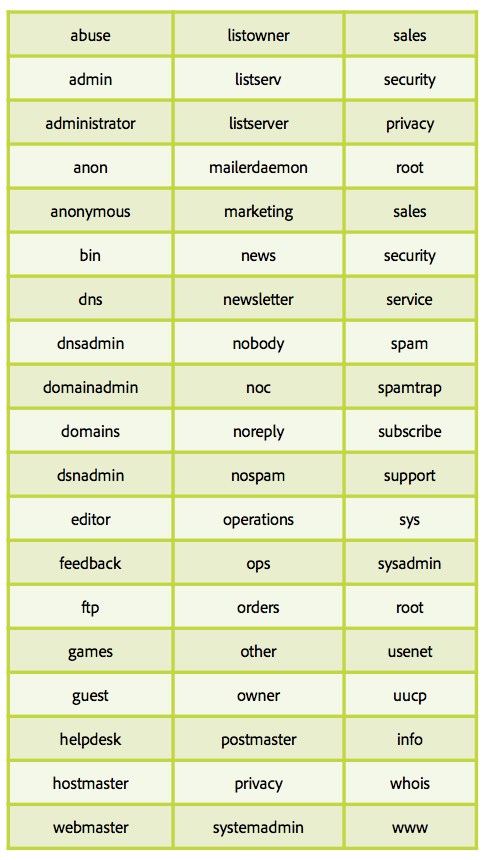
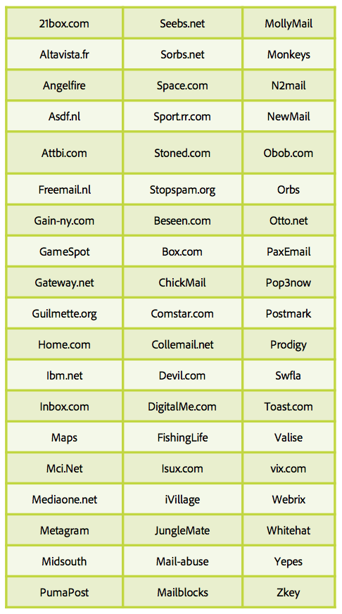

# All about spam traps

A [spam trap](/help/metrics/spam-traps.md) is a valid address, without error message when emails are sent to. A spam trap has a main mission: identify spammers or senders without data hygiene process.

## Who manages these spam trap addresses?

The first type of spam trap addresses is the IP and Domain blocklist company such as SpamHaus, Sorbs, SpamCop. These companies have a huge network of addresses which are dispatched on various Internet pages as website, blog, forums so that theirs addresses are collected by spammers.

The second type of spam trap is based old active ISP addresses. These ISPs have their own spam trap network built on inactive addresses reconverted in trap and each hit impacting the sender IP and domain reputation.

## How does it work?

**An email address without end user**: These addresses do not have and will never have an end user who could register to newsletters or any other type of communications.

**An email address abandoned by a user**: After a period of inactivity, addresses are deactivated by ISPs. Bounces messages are sent to senders to inform them about this new status. Senders must push in quarantine these addresses or remove them form future communications. ISPs use these addresses transformed in ‘spam trap’ to monitor senders with bad practices.

## How to recognize or identify a spam trap?

It is a difficult job to identify spam traps, these addresses must stay anonymous as they are used to identify bad senders. Most part of ISPs does not have open and click system to monitor bad senders hits. According to previous definitions, it is possible to determinate a pod of suspicious addresses and test the efficiency of the pod selection.

## Why your database is infected by spam traps?

Your email addresses database contains spam trap, how could it be possible? The two majors reasons are a lack in the database hygiene process or collect dysfunction.

These few points help you to check your processes:

* Collect dysfunction:
    * Where your email addresses are coming from? How many sources are used to collect these addresses? Are you able to identify them? Internal/coregistration?
    * Is your opt-in system working properly?
    * Did you check domains and alias of your addresses? Do it with the table below!
* Database hygiene process:
    * What is your process regarding inactive address on the last 12 months? 
    * Are you processing a quarantine on soft bounces as ‘inactive user’? 
    * When is the last time you took care of your database and tried to clean it up? Do it regularly.

## Aliases and domains to avoid

**Aliases**

**Domains**

