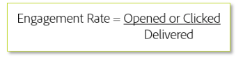

# Transition process - Switching email platforms

When moving email service providers (ESPs), it’s not possible to also transition your existing, established IP addresses. It’s important that you follow best practices for developing a positive reputation when starting afresh. Because the new IP addresses you will be using do not yet have reputation, ISPs are unable to fully trust the mail coming from them and need to be cautious in what they allow to be delivered to their customers.

Think about what you do when meeting someone new. Typically, you need to build trust in-stead of trusting them right away. Don’t think that your brand is going to automatically help with that trust, because spammers will user your name to do bad things. ISPs need to revaluate your sending practices, since action is most telling in email deliverability.

Establishing a positive reputation is a process. But once it’s established, small negative indicators will have less impact to you and your mail delivery.

The amount of time to warm your IP addresses and domains may vary, but up to an eight-week benchmark is common for typical senders to establish a reputation at most Tier 1 ISPs ([!DNL Gmail], [!DNL Microsoft], [!DNL Verizon]/[!DNL Yahoo]/[!DNL AOL], etc.). 
In the next sections, we’ll investigate some key areas to focus on to onboard properly.

## Infrastructure

Successful deliverability depends on a strong foundation. Email infrastructure is a core element. A properly constructed email infrastructure includes multiple components — namely domain(s) and IP address(es). These components are like the machinery behind the emails you send, and they’re oftentimes the anchor of sending reputation. Deliverability consultants ensure that these elements are set up properly during implementation, but due to the reputation element, it’s important for you to have this basic understanding.

### Domain setup and strategy

Times have changed, and some ISPs (like [!DNL Gmail] and [!DNL Yahoo]) now incorporate domain reputation as an additional point when it comes to attaching email reputation to a sender. Your domain reputation is based on your sending domain instead of your IP address. This means that your brand takes precedence when it comes to ISP filtering decisions.

Part of the onboarding process for new senders on Adobe Campaign includes setting up your sending domains and ensuring that your infrastructure is established properly. You should work with an expert on what domains you plan to use in the long term. Here are some tips that shape a good domain strategy:

* Be as clear and reflective of the brand as possible with the domain you choose so that users don’t incorrectly identify the mail as spam. Some examples are [!DNL newsletter.foo.com], [!DNL receipts.foo.com], and so on.
* You shouldn’t use your parent or corporate domain as it could impact the delivery of mail from your organization to ISPs.
* Consider using a subdomain of your parent domain to legitimize your sending domain.
* Separate your subdomains for transactional and marketing message categories. This will help your email traffic flow on a more reliable basis as ISPs look for this sending method, which is a known email best practice and is highly recommended.

### IP strategy

It’s important to form a well-structured IP strategy to help establish a positive reputation. The number of IPs and setup varies depending on your business model and marketing goals. Work with an expert to develop a clear strategy to start off right. Consider these things that are important to note:

* Too many IPs can trigger reputation issues as it is a common tactic of spammers to snowshoe, which is a tactic used by spammers where traffic is spread across many IPs to maximize the delivery of spam mail. Even though you’re not a spammer, you might look like one if you use too many IPs, especially if those IPs haven’t had any prior traffic.
* Too few IPs can cause throughput issues and potentially trigger reputation issues. Throughput varies by ISP. How much and how quickly an ISP is willing to accept is typically based on their infrastructure and sending reputation thresholds.
* Separating traffic for messaging types is key. It’s important to, at a bare minimum, separate marketing and transactional mail on separate IP pools.
* Depending on your mail strategy, it may also be advisable to separate different products or marketing streams on different IP pools if your reputation is drastically different. Some marketers also segment by region. Separating the IP for traffic with a lower reputation will not fix the reputation issue, but it will prevent issues with your “good” reputation email deliveries. After all, you don’t want to sacrifice your good audience for a riskier one.
  
### Feedback loops

Behind the scenes, Adobe Campaign is processing data regarding bounces, complaints, unsubscribes, and more. The setup of these feedback loops is an important aspect to deliverability. Complaints can damage a reputation, so you should remove email addresses that register complaints from your target audience. It’s important to note that [!DNL Gmail] doesn’t provide this data back. List unsubscribe headers and engagement filtering are especially important for [!DNL Gmail] subscribers, who now comprise the majority of subscriber databases.

### Authentication

Authentication is the process that ISPs use to validate the identity of a sender. The two most common authentication protocols are [!DNL Sender Policy Framework (SPF)] and [!DNL DomainKeys Identified Mail] (DKIM). These are not visible to the end user but do help ISPs filter email from verified senders. [!DNL Domain-based Message Authentication Reporting and Conformance] (DMARC) is gaining popularity, although its policies aren’t yet incorporated by all ISPs in their reputation systems.

#### **SPF**

[!DNL Sender Policy Framework (SPF)] is an authentication method that allows the owner of a domain to specify which mail servers they use to send mail from that domain.

#### **DKIM**

[!DNL Domain Keys Identified Mail (DKIM)] is an authentication method that is used to detect forged sender addresses (commonly called [!DNL spoofing]). If DKIM is enabled, it allows the receiver to confirm if the sender is authorized to send mail from that domain.

#### **DMARC**

[!DNL Domain-based Message Authentication, Reporting and Conformance (DMARC)] is an authentication method that gives domain owners the ability to protect their domain from unauthorized use. DMARC uses SPF or DKIM or both to allow a domain owner to control what happens to mail that fails authentication: delivered, quarantined, or rejected.

## Targeting criteria

When sending new traffic, only target your highest engaged users during the early phases of IP warming. This helps establish a positive reputation from the get-go to effectively build trust before rolling in your less engaged audiences. Here’s a basic formula for engagement:

Typically, an engagement rate is based on a specific period of time. This metric can vary drastically depending on if the formula is applied on an overall level or for specific mailing types or campaigns. The specific targeting criteria needs to be provided by working with your Adobe Campaign deliverability consultant, since every sender and ISP varies and usually requires a customized plan.

## ISP-specific considerations during IP warming

ISPs have different rules and different ways of looking at their traffic. For example, [!DNL Gmail] is one of the most sophisticated ISPs because they look at engagement very strictly (opens and clicks) in addition to all other reputation measures. This requires a customized plan that only targets the highest engaged users at the onset. Other ISPs may require the same as well. Work with your Adobe Campaign deliverability consultant for a specific plan.

## Volume

The volume of mail you’re sending is critical to establishing a positive reputation. Put yourself in an ISPs shoes — if you start seeing a ton of traffic from someone you don’t know, it would be alarming. Sending large volume of mail right away is risky and is sure to cause reputation issues that are often difficult to resolve. It can be frustrating, time consuming, and costly to dig yourself out of poor reputation and bulking and blocking issues resulting from sending too much too soon.

The volume thresholds vary by ISP and can also vary depending on your average engagement metrics. Some senders require a very low and slow ramp of volume, whereas others may allow for a steeper ramp in volume. We recommend working with an expert, like an Adobe Campaign deliverability consultant, to develop a customized volume plan.

Here’s a list of hints and tips for how to transition smoothly:

* **Permission** is the foundation of any successful email program.
* **Low and slow-start** with low sending volumes and then increase as you establish your sender reputation.
* A **tandem mailing strategy** allows you to ramp up volume on Campaign while winding down with your current ESP, without disrupting your email calendar.
* **Engagement matters** - start with the subscribers who open and click your emails regularly.
* **Follow the plan** — our recommendations have helped hundreds of Campaign clients successfully ramp up their email programs.
* **Monitor your reply email account**. It’s a bad experience for your customer to use [!DNL nore-ply@xyz.com] or to not respond.
* Inactive addresses can have a negative deliverability impact. **Reactivate and repermission** on your current platform, not your new IPs.
* **Domains** - use a sending domain that’s a subdomain of your company’s actual domain. For example, if your company domain is [!DNL xyz.com], [!DNL email.xyz.com] provides more credibility to the ISPs than [!DNL xyzemail.com]
* **Transparency** - registration details for your email domain should be available publicly and shouldn’t be private.

In many circumstances, transactional mail doesn’t follow the traditional promotional warming approach. It’s obviously difficult to control volume in transactional mail due to its nature, since it generally requires a user interaction to trigger the email touch. In some cases, transactional mail can simply be transitioned without a formal plan. In other cases, it might be better to transition each message type over time to slowly grow the volume. For example, you may want to transition as follows:

1. Purchase confirmations - high engagement generally
2. Cart abandon - medium-high engagement generally
3. Welcome emails - high engagement but can contain bad addresses depending on your list collection methods
4. Win-back emails - lower engagement generally

## Additional resources

* [Starting a new platform](https://docs.adobe.com/content/help/en/campaign-standard/using/testing-and-sending/managing-deliverability/starting-new-platform.html)
