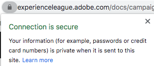

# SSL certificate request process

Once you have delegated a domain to Adobe for sending email (see [Domain name setup](/help/putting-it-in-practice/ac-domain-name-setup.md)), Adobe will create and use certain subdomains for specific functions.

For example, if you have delegated *email.example.com* to Adobe for sending emails, Adobe will create subdomains such as the following:
* *t.email.example.com* - for tracking links
* *m.email.example.com* - for mirror pages
* *res.email.example.com* - for hosted resources (such as images)

It is recommended to **secure these domains via SSL (HTTPS)**. Indeed, unsecured links (HTTP) are vulnerable to interception and will flag up warnings on modern browsers.

To install SSL certificates on these subdomains, the process involves requesting a CSR file and subsequently purchasing SSL certificates for Adobe to install or renew.

>[!CAUTION]
>
>Before installing an SSL certificate, make sure you are aware of the prerequisites listed on [this page](https://experienceleague.adobe.com/docs/control-panel/using/subdomains-and-certificates/renewing-subdomain-certificate.html#installing-ssl-certificate).
>
>Adobe will only support up to 2048-bit certificates. 4096-bit certificates are not yet supported.

## Glossary

| Term | Description |
|--- |--- |
| CA (Certificate Authority) | An SSL certificate provider that issues digital certificates to organizations or individuals after verifying their identity, such as DigiCert, Symantec, etc.<ul><li>A trusted CA is usually considered as a third-party CA which issues a root certificate.</li><li>If the certificate is signed by the same organization/company that is using the certificate, it is classified as untrusted CA even when they are SSL certificates, such as self-signed certificates.</li></ul> |
| Chain certificate | A certificate which includes a root certificate and one or more intermediate certificates is called a chain (or chained) certificate. |
| CSR (Certificate Signing Request) | A block of encoded text that is given to a Certificate Authority when applying for an SSL certificate. It is usually generated on the server where the certificate will be installed. |
| DER (Distinguished Encoding Rules) |  A certificate extension type. The .der extension is used for binary DER encoded certificates. These files may also support the .cer or .crt extension. |
| EV (Extended Validation) certificate | An EV certificate is a new type of certificate that is designed to prevent phishing attacks. It requires extended validation of your business and of the person ordering the certificate. |
| High assurance certificate | High assurance certificates are issued by the CA after verifying ownership of the domain name and valid business registration. |
| Intermediate CA | A Certificate Authority of intermediate certificates included in a chain certificate. |
| Intermediate certificate | A Certificate Authority issues certificates in the form of a tree structure. The root certificate is the top-most certificate of the tree. Any certificate between your certificate and the root certificate is called a chain or intermediate certificate. |
| Low assurance certificate | A low assurance certificate, also referred as domain validated certificate, includes only the domain name in the certificate (and not the business/organization name). |
| PEM (Privacy Enhanced Mail) | A certificate with a .pem extension which contains ASCII (Base64) data. Such certificates start with a " - - - - - BEGIN CERTIFICATE - - - - -" line. |
| Root certificate | A Certificate Authority issues certificates in the form of a tree structure. The root certificate is the top-most certificate of the tree. |
| SAN (Subject Alternative Name) | The subject alternative names are additional host names (sites, IP addresses, common names, etc.) that should be signed as part of a single SSL certificate. |
| Self-signed certificate | A certificate that is signed by the person creating it rather than a trusted certificate authority. Self-signed certificates can enable the same level of encryption as a certificate signed by a CA, but there are two major drawbacks:<ul><li>A visitor's connection could be hijacked allowing an attacker to view all the data sent (thus defeating the purpose of encrypting the connection)</li><li> The certificate cannot be revoked like a trusted certificate can.</li></ul> |
| SSL (Secure Sockets Layer) |  The standard security technology for establishing an encrypted link between a web server and a browser. |
| Wildcard certificate | A wildcard certificate can secure an unlimited number of first level subdomains on a single domain name, such as *.adobe.com. |

## Main steps

1. Ask for a Certificate Signing Request (CSR) file and provide the required information (country, state, city, organization name, organizational unit name, etc.) to Adobe.
1. Validate the CSR file generated by Adobe and verify that all information you provided is correct.
1. Use the CSR details to generate a certificate signed by a trusted Certification Authority<!--taking care of asking for using the subjectAltName SSL extension (SAN) if it is for several domain names, and get/purchase the resulting certificate (ideally) in PEM format for Apache server-->.
1. Validate the SSL certificate and verify it matches the CSR.
1. Provide the SSL certificate to Adobe, who will install it.
1. Test that the SSL certificate is successfully installed for each secured subdomain.
1. Monitor the SSL certificate validity period.
1. Update any specific configuration in Adobe Campaign.

## Detailed process

### Prerequisites

You must identify the domain names and the functions (tracking, mirror pages, webapps, etc.) to secure.
>[!NOTE]
>
>Adobe can help in defining the domain names and functions to involve. For more information, contact your Adobe Customer Success Manager.

### Step 1 - Get a CSR file

To obtain a CSR (Certificate Signing Request) file, follow the steps below.

* If you have access to the [Control Panel](https://experienceleague.adobe.com/docs/control-panel/using/control-panel-home.html), follow the instructions on [this page](https://experienceleague.adobe.com/docs/control-panel/using/subdomains-and-certificates/renewing-subdomain-certificate.html#subdomains-and-certificates) to generate and download a CSR file from the Control Panel.

* Otherwise, create a Support ticket via https://adminconsole.adobe.com/ to obtain a CSR file from Adobe Customer Care for the required subdomain(s).

Here are a few best practices to follow:

* Raise one request per delegated subdomain.
* It is possible to combine multiple subdomains into a single CSR request, but only within the same environment. For example, in Campaign Classic, the marketing server, the [mid-sourcing server](https://experienceleague.adobe.com/docs/campaign-classic/using/installing-campaign-classic/additional-configurations/mid-sourcing-server.html) and the [execution instance](https://experienceleague.adobe.com/docs/campaign-classic/using/transactional-messaging/instance-configuration/creating-a-shared-connection.html) are three separate environments.
* You must get a new CSR before any SSL certificate renewal. Do not use an old CSR file from one year ago or more.

You will need to provide the following information.

>[!CAUTION]
>
>All the fields indicated in the tables below must be filled in. Otherwise, the CSR request cannot be processed.

**Information to provide with the assistance of the Adobe team:**

| Information to provide | Example value | Note |
|--- |--- |--- |
| Client Name | My Company Inc.	| Name of your organization. This field is used by Adobe for tracking your request (it will not be part of the CSR/SSL certificate).
| Adobe Campaign Environment URL | https://client-mid-prod1.campaign.adobe.com | Adobe Campaign instance URL.
| Common Name [CN] | t.subdomain.customer.com | This can be any of the relevant domains, but usually the tracking domain. |
| Subject Alternative Name [SAN] | t.subdomain.customer.com | Make sure to include tracking subdomain as a SAN. |
| Subject Alternative Name [SAN] | m.subdomain.customer.com |
| Subject Alternative Name [SAN] | res.subdomain.customer.com |

**Information to provide by your IT/SSL internal team:**

| Information to provide | Example value | Note |
|--- |--- |--- |
| Country [C] | US | This must be a two-letter code. Access the full country list [here](https://www.ssl.com/csrs/country_codes/). *Note: For United Kingdom, use GB (not UK).* |
| State (or Province Name) [ST]	| Illinois | If applicable. The value must be a full name, not abbreviated. |
| City/Locality Name [L] | Chicago |
| Organization Name [O] | ACME |
| Organizational Unit Name [OU]	| IT |

>[!NOTE]
>
>Replace "subdomain.customer.com" with your delegated subdomain, and the other example values with the appropriate values.

### Step 2 - Validate the CSR file

After submitting your request with the relevant information, Adobe generates and provides you with a Certificate Signing Request (CSR) file.

The text in the resulting CSR file should start with **"-----BEGIN CERTIFICATE REQUEST-----"**.

Once you receive the CSR file from Adobe, follow the steps below:

1. Copy and paste the CSR file text into an online decoder such as https://www.sslshopper.com/csr-decoder.html, <!--https://www.certlogik.com/decoder/,--> or https://www.entrust.net/ssl-technical/csr-viewer.cfm.
    Alternatively, you can use the *OpenSSL* command locally on a Linux machine. For more on this, refer to [this external page](https://www.question-defense.com/2009/09/22/use-openssl-to-verify-the-contents-of-a-csr-before-submitting-for-a-ssl-certificate).
1. Verify that all the checks are successful.
1. Check that the correct parameters and domain names are included.
1. Check that all the other data match the details you provided upon submitting your request.

### Step 3 - Generate the SSL certificate

Once the CSR file is provided, you must purchase and generate an SSL certificate for the appropriate domains using the CSR file.

* The SSL certificate:
    * must be in Apache PEM format;
    * should not be longer than 2048 bits;
    * must be signed by a valid CA (Certification Authority);
    * must include all SANs (Subject Alternative Names) as mentioned in the CSR file.
* If there are one or more intermediate certificates, you must provide the root certificate and all intermediate certificates to Adobe.
* You can set any certificate validity period, but Adobe recommends to choose it long enough (two years for example).

>[!NOTE]
>
>If you are using your own internal tools or a portal provided by a CA to request the certificate, make sure to use the same details as provided in the CSR request to avoid any delays or discrepancies in the certificate generation process.

### Step 4 - Validate the SSL certificate

Once the SSL certificate is generated, you must validate it before sending it to Adobe. To do so, follow the steps below:

1. Make sure the certificate have the .pem extension. If this is not the case, convert it to PEM format. You can make the conversion using *OpenSSL*.
1. Confirm that the certificate starts with **"-----BEGIN CERTIFICATE-----"**.
1. Copy the certificate text into an online decoder, such as https://www.sslshopper.com/certificate-decoder.html, or https://www.entrust.net/ssl-technical/csr-viewer.cfm.
    Alternatively, you can use the *OpenSSL* command locally on a Linux machine. For more on this, refer to [this external page](https://www.shellhacks.com/decode-ssl-certificate/).
1. Make sure the certificate resolves properly including the Common Name, SAN, Issuer and Validity Period.
1. If the SSL certificate verification is successful, check that the certificate matches the CSR using [this website](https://www.sslshopper.com/certificate-key-matcher.html): select **Check if a CSR and a certificate match**, and enter your certificate and your CSR in the corresponding fields. They should match.

### Step 5 - Request the SSL certificate installation

* If you have access to the [Control Panel](https://experienceleague.adobe.com/docs/control-panel/using/control-panel-home.html), follow the instructions on [this page](https://experienceleague.adobe.com/docs/control-panel/using/subdomains-and-certificates/renewing-subdomain-certificate.html#installing-ssl-certificate) to upload the certificate to Control Panel.

* Otherwise, create another Support ticket via https://adminconsole.adobe.com/ to request Adobe to install the certificate on the Adobe server(s).

You’ll need to provide:

* The certificate file, the root certificate and any intermediate certificates (attached to the ticket), preferably in Apache PEM format.
* The number of the previous Support ticket raised for the CSR.
* The same data that was provided for the CSR ticket (including Common Name, Instance URL, State, City/Locality, Organization Name, Organization Unit Name, etc.).

### Step 6 - Test the SSL certificate installation

Once the SSL certificates is installed and confirmed by Adobe Customer Care, make sure that it has been successfully installed for all URLs.

Perform the tests below before closing the SSL installation ticket. Also make sure you update any specific configuration as instructed in [this section](#update-configuration).

Navigate to the following URLs in your browser (replace "subdomain.customer.com" with your subdomain):

* https://subdomain.customer.com/r/test (for [web applications](https://experienceleague.adobe.com/docs/campaign-classic/using/designing-content/web-applications/about-web-applications.html) subdomains only - does not apply to email subdomains)
* https://t.subdomain.customer.com/r/test
* https://m.subdomain.customer.com/r/test
* https://res.subdomain.customer.com/r/test

A successful result gives environment information, and the address bar in the URL indicates that the connection is secure. For example, you can see the following message in Google Chrome:

If the SSL certificate is not installed properly, the following warning is displayed:

### Step 7 - Check the certificate validity period

You can check the validity period of the certificate in your browser. For example, in Google Chrome, click **Secure** > **Certificate**.

It is your responsibility to check the validity period. Adobe recommends you implement a process to monitor certificate expiry. Learn more on what happens when your SSL certificate expires in [this article](https://www.thesslstore.com/blog/what-happens-when-your-ssl-certificate-expires/).

* Create a Support ticket to request an updated certificate at least two weeks before the certificate expiry date. You do not need to request an additional CSR, unless the CSR details have changed.

* If you have access to the [Control Panel](https://experienceleague.adobe.com/docs/control-panel/using/control-panel-home.html), and if your environment is hosted by Adobe in an AWS environment, you can use the Control Panel to renew the certificate before it expires. Learn more in [this section](https://experienceleague.adobe.com/docs/control-panel/using/subdomains-and-certificates/monitoring-ssl-certificates.html#monitoring-certificates).

### Step 8 - Update any specific configuration {#update-configuration}

Once you are confident the requested SSL certificates are installed properly, you can update all references in Adobe Campaign from HTTP to HTTPS.

>[!NOTE]
>
>For Campaign Classic, the URLs to update are mainly located in the [Deployment wizard](https://experienceleague.adobe.com/docs/campaign-classic/using/installing-campaign-classic/initial-configuration/deploying-an-instance.html#deployment-wizard) and in the [External accounts](https://experienceleague.adobe.com/docs/campaign-classic/using/installing-campaign-classic/additional-configurations/external-accounts.html#installing-campaign-classic) (tracking, mirror page and public resource domains). For Campaign Standard, refer to [Branding configuration](https://experienceleague.adobe.com/docs/campaign-standard/using/administrating/application-settings/branding.html#about-brand-identity).

Once configurations are updated, new emails will be sent with HTTPS URLs rather than HTTP. To check the URLs are now secure, you can quickly perform the following tests: 

* Upload an image from Adobe Campaign. Once the image gets uploaded, the URL returned should be HTTPS.
* Create a test email delivery including a mirror page link, some images, text and an unsubscription link. Send out the email to an external email ID (such as your Gmail address). Once received, open the email and make sure all the links inside the email open correctly in their HTTPS form (not HTTP), without any SSL certificate warnings or errors.

## Product specific resources

**Campaign Classic**

* [Control Panel: Adding SSL certificates (tutorial)](https://experienceleague.adobe.com/docs/campaign-classic-learn/control-panel/subdomains-and-certificates/adding-ssl-certificates.html) - Learn how to add SSL certificates to secure your subdomains.

**Campaign Standard**

* [Control Panel: Adding SSL certificates (tutorial)](https://experienceleague.adobe.com/docs/campaign-standard-learn/control-panel/subdomains-and-certificates/adding-ssl-certificates.html) - Learn how to add SSL certificates to secure your subdomains.