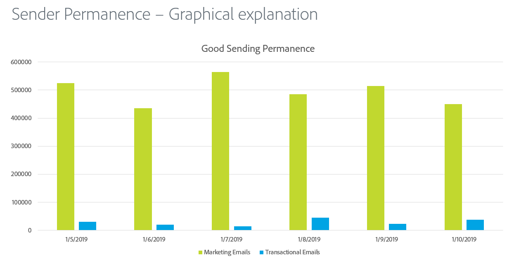
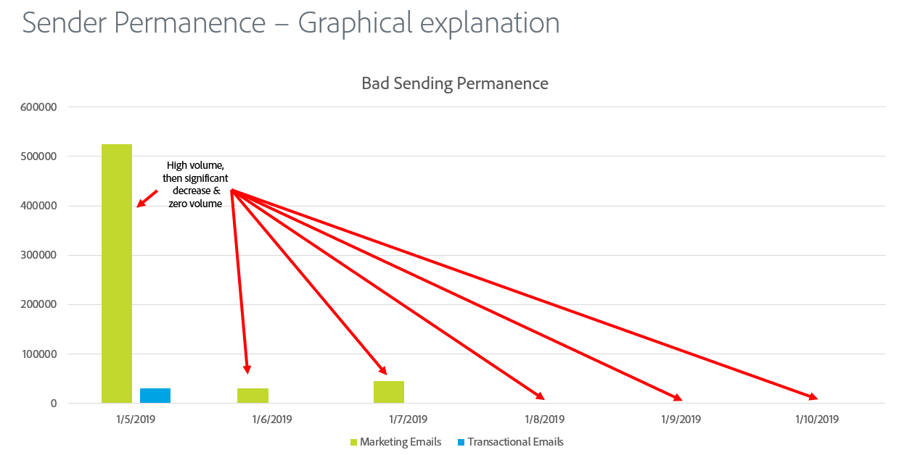

# Sender permanence

Sending permanence is the process of establishing a consistent sending volume and strategy in order to maintain ISP reputation. Here are some reasons why sender permanence is important:

* Spammers will typically “IP address hop,” meaning that they’ll constantly shift traffic across many IP addresses to avoid reputation issues.
* Consistency is key to prove to ISPs that the sender is reputable and not attempting to by-pass any reputation issues that are a result of poor sending practices.
* Maintaining these consistent strategies over a long period of time is required before some ISPs will even consider the sender reputable at all.

**Here are some examples:**

