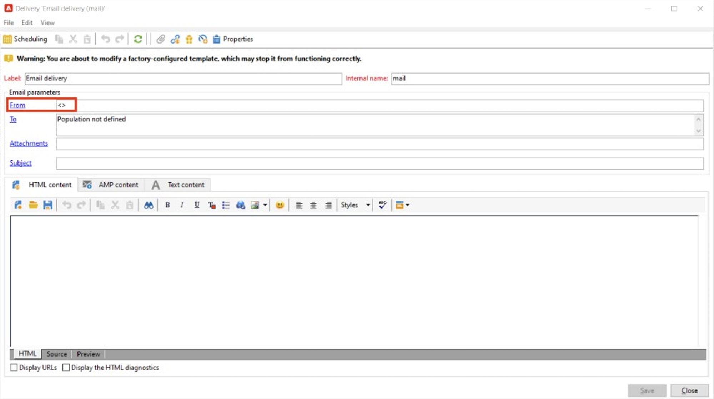
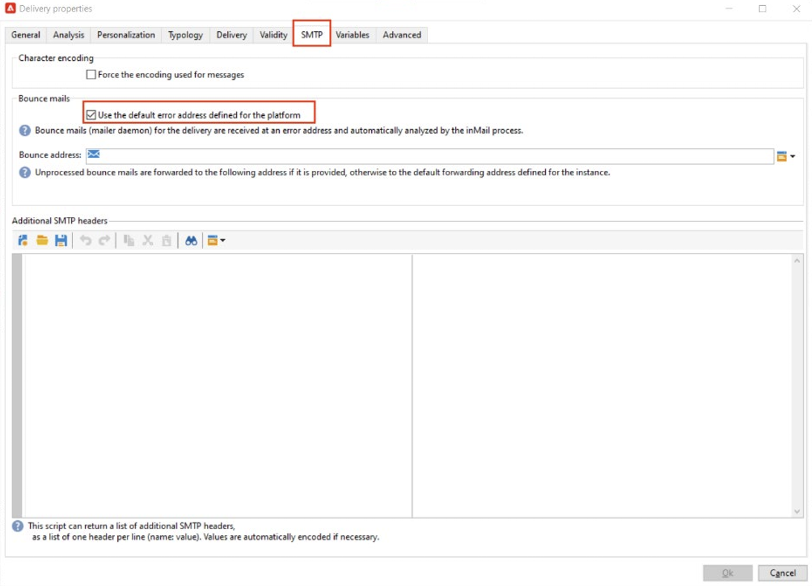
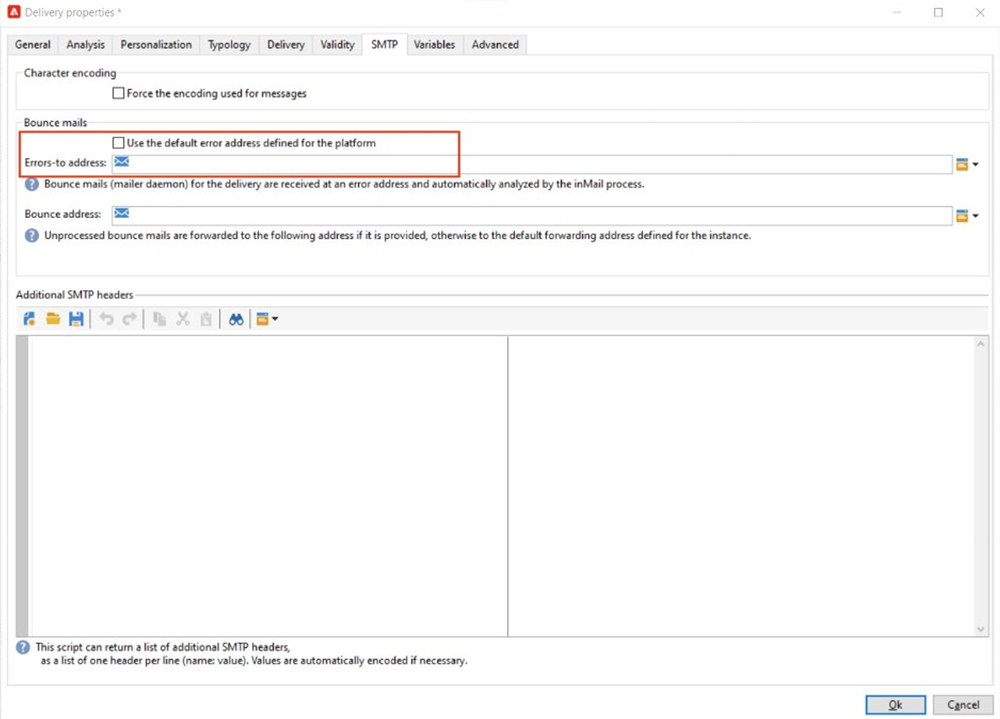

# Implement [!DNL Domain-based Message Authentication, Reporting and Conformance] (DMARC)

The purpose of this document is to provide the reader further information on the email authentication method, DMARC. Through explaining how DMARC works and its various policy options, readers will better understand DMARC’s impact on Email Deliverability. 

## What is DMARC? {#about}

Domain-based Message Authentication, Reporting and Conformance, is an email authentication method that allows domain owners the ability to protect their domain from unauthorized use. DMARC also provides feedback on email authentication status and allows senders to control what happens to emails that fail authentication. This includes options to monitor, quarantine or reject mail depending on which DMARC policy has been implemented.

DMARC has three policy options:

* **Monitor (p=none):** Instructs the mailbox provider/ISP to do whatever they would normally do to the message.
* **Quarantine (p=quarantine):** Instructs the mailbox provider/ISP to deliver mail that does not pass DMARC to the recipient's spam or junk folder.
* **Reject (p=reject):** Instructs the mailbox provider/ISP to block mail that does not pass DMARC resulting in a bounce.

## How does DMARC work? {#how}

SPF and DKIM are both used to associate an email with a domain and work together to authenticate email. DMARC takes this one step further and helps to prevent spoofing by matching the Domain checked by DKIM and SPF. To pass DMARC, a message must pass SPF or DKIM. If both of these fail authentication, DMARC will fail, and the email will be delivered according to your selected DMARC policy.

>[!NOTE]
>
>DMARC requires alignment between the ‘From” and ‘Return-Path’ address.

## Why should DMARC be implemented? {#why}

DMARC is optional, and while it is not required, it is free and allows for email receivers to easily identify the authentication of emails, which could potentially improve delivery. One of the key benefits of DMARC is that it offers reporting on which messages fail SPF and/or DKIM. It also gives senders a degree of control over what happens with mail that does not pass either of these authentication methods. Through DMARC reporting, senders gain visibility into which messages are failing DMARC, allowing for steps to be taken to mitigate further errors.

>[!NOTE]
>
>If you would like to implement BIMI a p=quarantine or p=reject DMARC policy is required.

## Best Practices for Implementing DMARC {#best-practice}

As DMARC is optional, it will not be configured by default on any ESP’s platform. A DMARC record has to be created in DNS for your domain in order for it to work. Additionally, an email address of your choosing is required to indicate where DMARC reports should go within your organization. As a best practice, it is
recommended to slowly roll out DMARC implementation by escalating your DMARC policy from p=none, to p=quarantine, to p=reject as you gain DMARC understanding of DMARC’s potential impact.

1. Analyze the feedback you receive and use (p=none), which tells the receiver to perform no actions against messages that fail authentication, but still send email reports to the sender. Also, review and fix issues with SPF/DKIM if legitimate messages are failing authentication.
1. Determine if SPF and DKIM are aligned and passing authentication for all legitimate email, and then move the policy to (p=quarantine), which tells the receiving email server to quarantine email that fails authentication (this generally means placing those messages in the spam folder).
1. Adjust policy to (p=reject). The p= reject policy tells the receiver to completely deny (bounce) any email for the domain that fails authentication. With this policy enabled, only email that is verified as 100% authenticated by your domain will even have a chance at Inbox placement.

    >[!NOTE]
    >
    >Please use this policy with caution and determine if it is appropriate for your organization.

## DMARC Reporting {#reporting}

DMARC offers the ability to receive reports regarding emails that fail SPF/DKIM. There are two different reports generated by ISP servicers as part of the authentication process that senders can receive through the RUA/RUF tags in their DMARC policy:

* **Aggregate Reports (RUA):** Does not contain any PII (Personally Identifiable Information) that would be GDPR sensitive.
* **Forensic Reports (RUF):** Contains email addresses which are GDPR sensitive. Before utilizing, it is best to check internally how to deal with information that needs to be GDPR compliant.

The main use of these reports is to receive an overview of emails that are attempted spoofing. These are highly technical reports that are best digested through a third-party tool. A few companies that specialize in DMARC monitoring are:

* [ValiMail](https://www.valimail.com/products/#automated-delivery)
* [Agari](https://www.agari.com/)
* [Dmarcian](https://dmarcian.com/)
* [Proofpoint](https://www.proofpoint.com/us)

### Example DMARC Record {#example}

```
v=DMARC1; p=reject; fo=1; rua=mailto:dmarc_rua@emaildefense.proofpoint.com;ruf=mailto:dmarc_ruf@emaildefense.proofpoint.co
```

## DMARC Tags & What They Do {#tags}

DMARC records have multiple components called DMARC tags. Each tag has a value that specifies a certain aspect of DMARC.

|Tag Name|Required/Optional|Function|Example|Default value|
|  ---  |  ---  |  ---  |  ---  |  ---  |
|v|Required|This DMARC tag specifies the version. There is only one version as of now, so this will have a fixed value of v=DMARC1|V=DMARC1 DMARC1|DMARC1|
|p|Required|Shows the DMARC policy selected and directs the receiver to report, quarantine or reject mail that fails authentication checks.|p=none, quarantine, or reject|-|
|fo|Optional|Allows the domain owner to specify reporting options.|0: Generate report if everything fails<br/>1: Generate report if anything fails<br/>d: Generate report if DKIM fails<br/>s: Generate report if SPF fails|1 (recommended for DMARC reports)|
|pct|Optional|Tells the percentage of messages subjected to filtering.|pct=20|100|
|rua|Optional (recommended)|Identifies where aggregate reports will be delivered.|`rua=mailto:aggrep@example.com`|-|
|ruf|Optional (recommended)|Identifies where forensic reports will be delivered.|`ruf=mailto:authfail@example.com`|-|
|sp|Optional|Specifies DMARC policy for subdomains of the parent domain.|sp=reject|-|
|adkim|Optional|Can either be Strict (s) or Relaxed (r). Relaxed alignment means the domain used in the DKIM signature can be a subdomain of the “From” address. Strict alignment means the domain used in the DKIM signature must be an exact match of the domain used in the from address.|adkim=r|r|
|aspf|Optional|Can either be Strict (s) or Relaxed (r). Relaxed alignment means that the ReturnPath Domain can be a subdomain of the From Address. Strict alignment means the Return-Path domain must be an exact match with the From address.|aspf=r|r|

## DMARC & Adobe Campaign {#campaign}

A common reason for DMARC failures is misalignment between the ‘From’ and ‘Errors-To’ or ‘Return-Path’ Address. To avoid this, when setting up DMARC, it is recommended to double check your ‘From’ and ‘Errors-To’ address settings in your Delivery Templates.

1. Within your Delivery Template, review what address is currently set as your ‘From’ address. 

    

1. From here, select ‘Properties’ which will allow you to further edit your delivery template. In this window, select SMTP and uncheck “Use the default error address defined for the platform” if selected. Delivery templates in Adobe Campaign select this checkbox by default. The default Error Address may not be the address associated with the From Address in this delivery template. 

    

1. When this box is unchecked, a text field appears that will allow you to enter a unique Error Address that uses the same domain as set in the From Address.

    

Once these changes are saved, you will be able to move forward with your DMARC implementation with correct domain alignment.

## Useful Links {#links}

* [DMARC.org](https://dmarc.org/){target="_blank"}
* [M3AAWG Email Authentication](https://www.m3aawg.org/sites/default/files/document/M3AAWG_Email_Authentication_Update-2015.pdf){target="_blank"}
