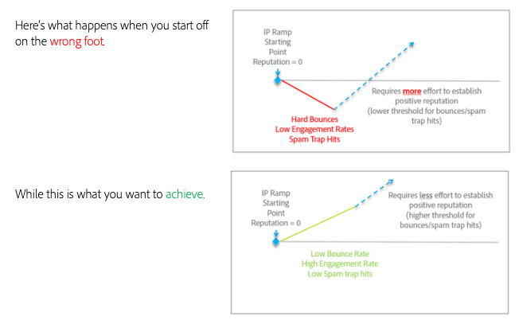

# How to transition smoothly when switching email platforms.

When moving email service providers (ESPs), it is not possible to also transition your existing, established IP addresses. It is important that you follow best practices for developing a positive reputation when starting afresh. Because the new IP addresses you will be using do not yet have reputation, ISPs are unable to fully trust the mail coming from them and need to be cautious in what they allow to be delivered to their customers.

Establishing a positive reputation is a process. But once it’s established, small negative indicators will have less impact to you and your mail delivery.

The amount of time to warm your IP addresses and domains may vary, but up to an eight-week benchmark is common for typical senders to establish a reputation at most Tier 1 ISPs (Gmail, Microsoft, Verizon/Yahoo/AOL, etc.).

In the next sections, we will investigate some key areas to focus on to onboard properly:

1. [Infrastructure](/help/transition-process/infrastructure.md)
2. [Targeting criteria](/help/transition-process/targeting-criteria.md)
3. [ISP-specific considerations during IP warming](/help/transition-process/isp-specific-considerations-during-ip-warming.md)
4. [Volume](/help/transition-process/volume.md)
